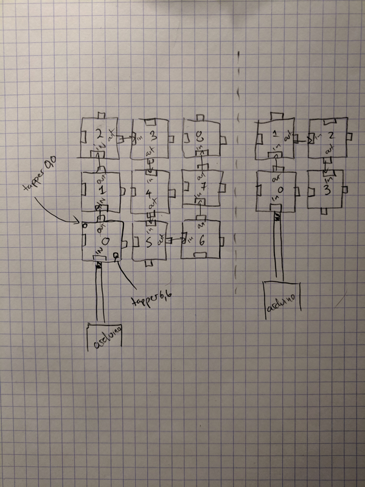

# Using v6

# Run for 1 board

* Go to the v6 firmware folder `cd tappytap/firmware/v6`
* run `pio run -t upload`
* Go to the processing sketch `cd tappytap/software/testerflexv6`
* Run the processing sketch
  * From interface
  * Alternately run on command line `processing-java --sketch=path/to/testerflexv6 --run`

# Change the number of boards

Not working right now

* Connect your boards as per diagram 
* Change processing line 14/15
* Change arduino line 5
* Rerun `pio run -t upload` in `cd tappytap/firmware/v6`
* Rerun processing